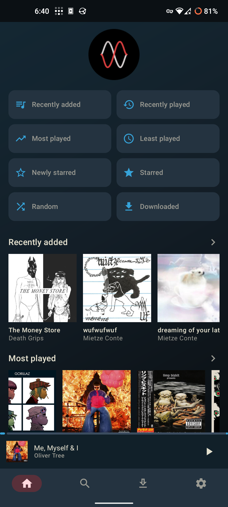
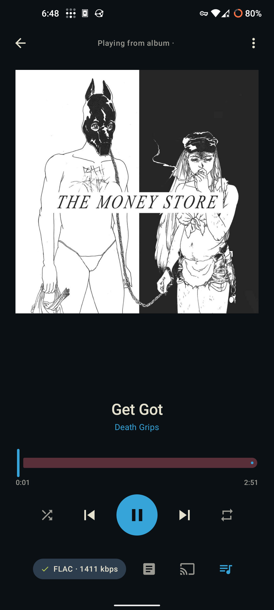
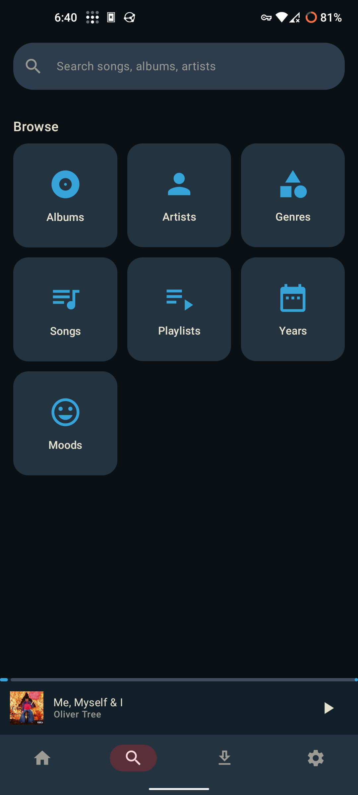
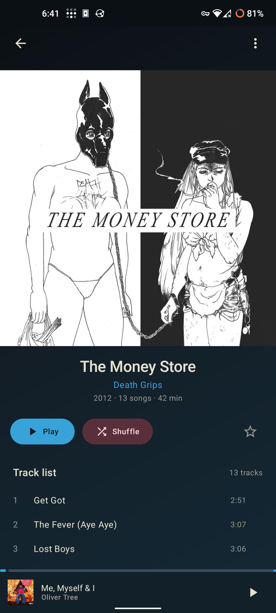
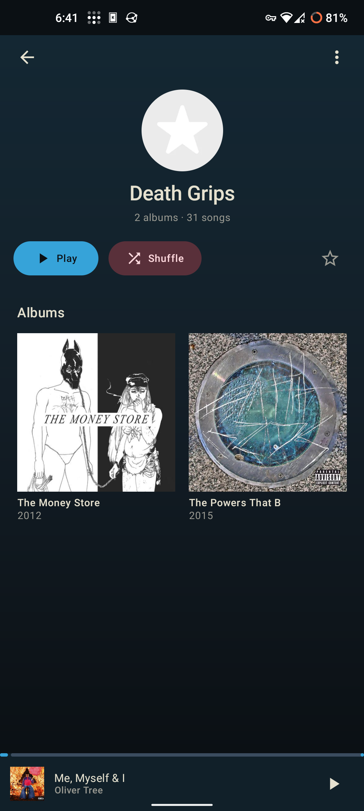
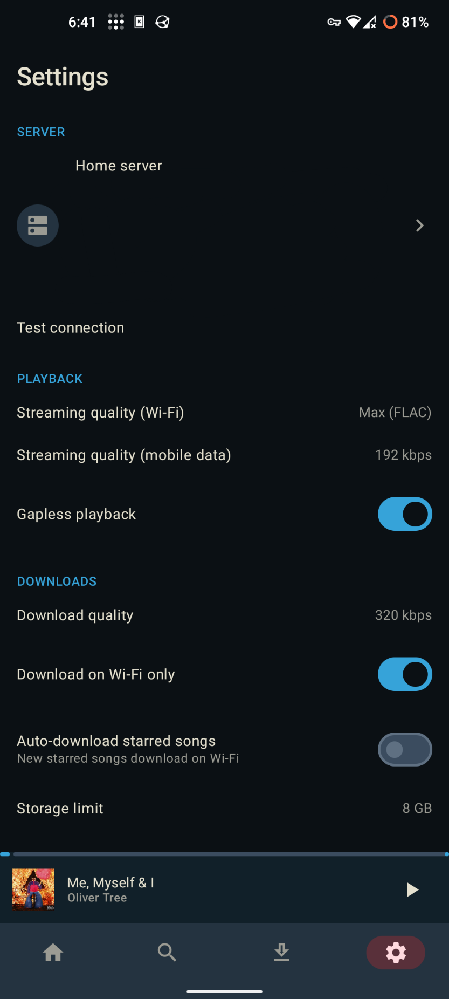

<div align="center">


<h1>Phaze</h1>

</div>

> My personal music player app

A friendly, dark-themed music player for **Subsonic-compatible servers**
(Navidrome, Airsonic, Gonic, Funkwhale…), built with Kotlin and Jetpack Compose.
Stream your library, browse albums and artists, manage your queue, and keep the
music playing — even when the phone is in your pocket.

---

## 📸 Screenshots

| **Hero** | **Now Playing** | **Search** |
|---|---|---|
|  |  |  |
| **Album** | **Artist** | **Settings** |
|  |  |  |

---

## ✨ Features

- **Server connection made easy** — paste your server URL, tap *Test connection*, done.
- **Home** discovery rails — recently added, most played, recently played, and random picks.
- **Search** — instant, debounced search across artists, albums, and songs.
- **Browse** — albums (grid or list), artists, songs, and playlists in one place.
- **Album & artist pages** — covers, track lists, and a star (favorite) toggle.
- **Now Playing** — full player with seek, shuffle, and repeat.
- **Queue** — reorder with drag-and-drop, remove, clear, or tap to play.
- **Background playback** — music keeps playing with a real media notification
  (play/pause + next/previous) that shows on the lock screen and media carousel.
- **Your style** — pick an accent color in Settings and the whole app re-themes.

---

## 🚀 Getting started

You only need two things: **JDK 17** and the **Android SDK** (platform 34).

```bash
# Build the app
./gradlew :app:assembleDebug

# Install on a connected phone
./gradlew :app:installDebug

# Run the unit tests
./gradlew :app:testDebugUnitTest
```

Then connect your server:

1. Open the app and enter your server URL (e.g. `https://music.example.com`).
2. Sign in with your Subsonic/OpenSubsonic username + password.
3. Tap **Test connection**, then **Connect** — and you're listening.

---

## 🤝 How to contribute

Contributions are welcome! Whether it's a bug fix, a new feature, or a mockup
improvement:

1. **Fork** the repo and create a branch: `git checkout -b feature/my-change`.
2. Follow the existing Kotlin + Compose style; use the theme tokens (colors,
   accent, typography) rather than hardcoding values.
3. Run the checks locally before opening a PR:

   ```bash
   ./gradlew :app:assembleDebug :app:testDebugUnitTest
   ./gradlew build        # also runs lint
   ```

4. **Open a pull request** and describe what you changed and why.

Useful guides for contributors:
- [`PLAN.md`](PLAN.md) — the full implementation plan and roadmap.
- [`mockups/`](mockups/) — design mockups (open `mockups/index.html` to view the gallery).

---

## 📚 More

- `.github/workflows/ci.yml` — CI pipeline (compile → tests → release APK + GitHub Release on tags).
- Found a bug? Open an issue with the device, Android version, and steps to reproduce.

Made with ❤️ and Kotlin.
